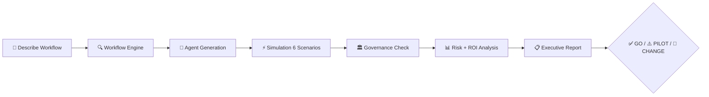
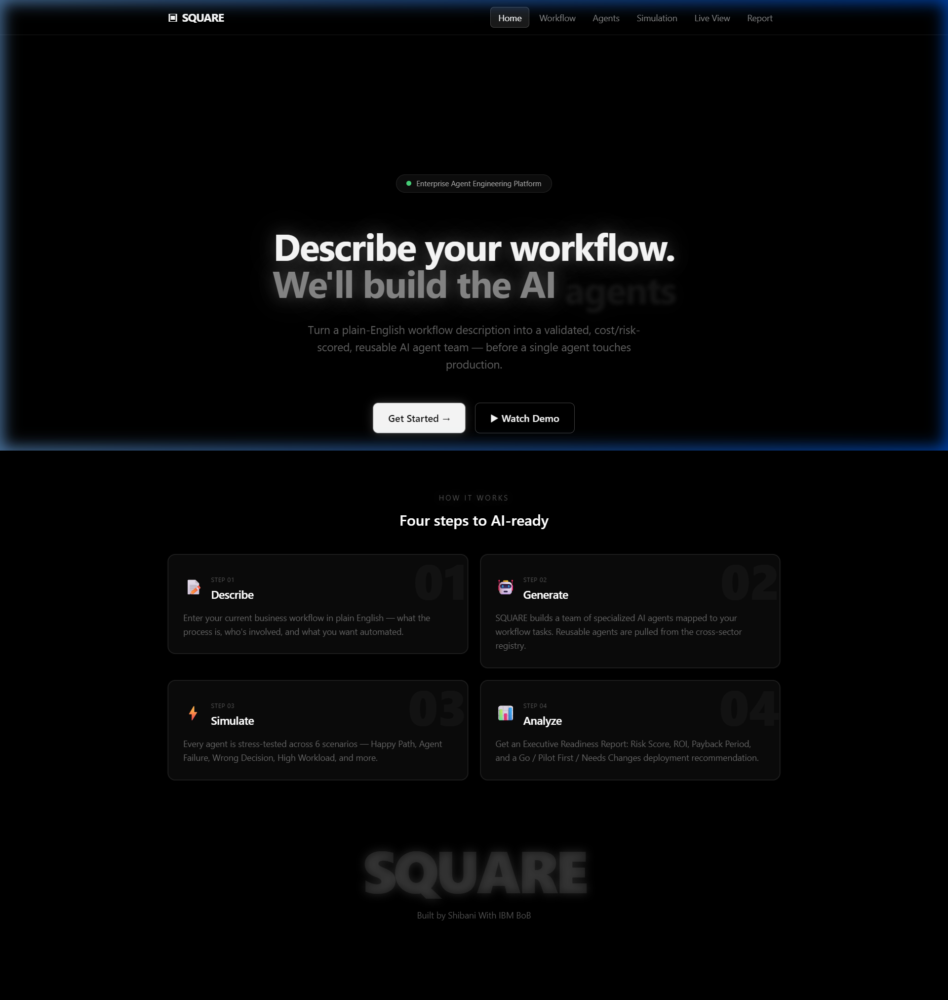
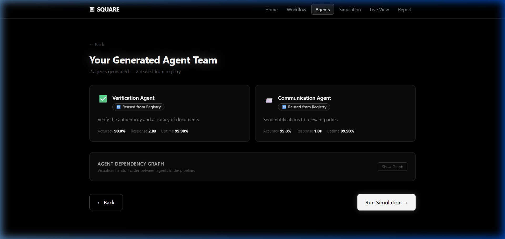
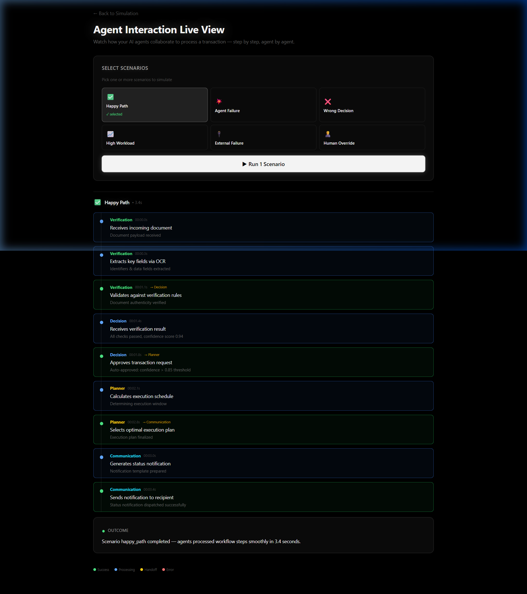
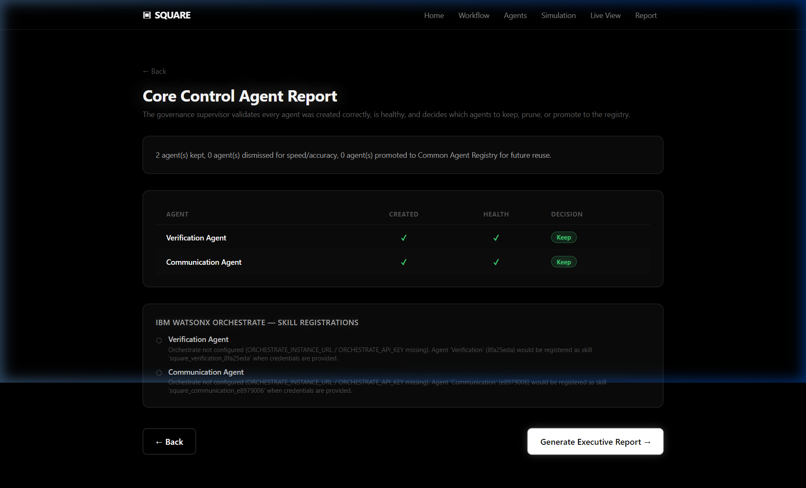
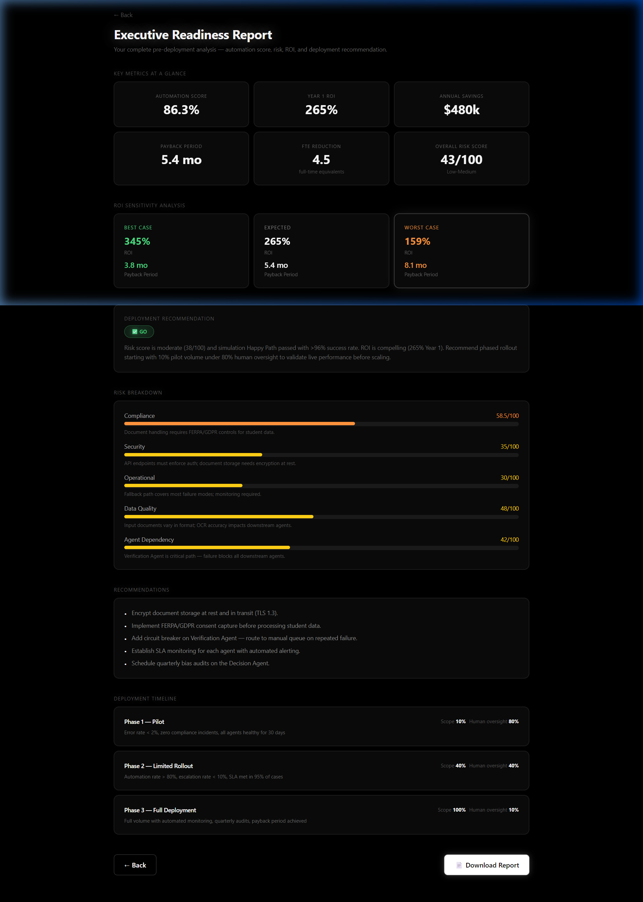

<div align="center">

```
███████╗ ██████╗ ██╗   ██╗ █████╗ ██████╗ ███████╗
██╔════╝██╔═══██╗██║   ██║██╔══██╗██╔══██╗██╔════╝
███████╗██║   ██║██║   ██║███████║██████╔╝█████╗  
╚════██║██║▄▄ ██║██║   ██║██╔══██║██╔══██╗██╔══╝  
███████║╚██████╔╝╚██████╔╝██║  ██║██║  ██║███████╗
╚══════╝ ╚══▀▀═╝  ╚═════╝ ╚═╝  ╚═╝╚═╝  ╚═╝╚══════╝
```

### ▣ Enterprise Agent Engineering Platform

> **"Describe your workflow. We'll build the AI workforce."**

[](https://python.org)
[](https://nextjs.org)
[](https://fastapi.tiangolo.com)
[](https://www.ibm.com/watsonx)
[](https://groq.com)
[](LICENSE)

---

**SQUARE** turns a plain-English workflow description into a validated, cost/risk-scored, reusable AI agent team — before a single agent touches production.

[🚀 Live Demo](#) • [📖 Documentation](#architecture) • [⚡ Quick Start](#local-setup)

</div>

---

## 🎯 The Problem

Enterprises want to automate workflows but can't confidently answer:

| ❓ Question | 💡 SQUARE's Answer |
|---|---|
| Which tasks should be automated? | Workflow Engine identifies automation candidates |
| Which AI agents are needed vs redundant? | Governance layer prunes unnecessary agents |
| What if an agent fails? | Simulation tests 6 failure scenarios |
| What are the compliance risks? | Industry-specific risk scoring (HIPAA, GDPR, PCI-DSS) |
| What's the expected ROI? | Financial analysis with sensitivity (best/worst/expected) |
| How much human oversight is needed? | Per-agent human-in-the-loop recommendations |

---

## 🏗️ Architecture

<details>
<summary><b>Click to expand full architecture diagram</b></summary>

```
┌─────────────────────────────────────────────────────────────┐
│                    Frontend (Next.js)                         │
│  Home → Workflow Input → Agents → Simulation → Governance    │
│         → Live View → Risk/ROI → Executive Report            │
└──────────────────────────┬──────────────────────────────────┘
                           │ REST API
┌──────────────────────────▼──────────────────────────────────┐
│                    Backend (FastAPI)                          │
│                                                              │
│  ┌─────────────────┐  ┌──────────────────┐                 │
│  │ Workflow Engine  │  │ Agent Generation │                  │
│  │ (Parses input)  │  │ (Creates agents) │                  │
│  └────────┬────────┘  └────────┬─────────┘                 │
│           │                     │                            │
│  ┌────────▼─────────────────────▼─────────┐                │
│  │         Common Agent Registry           │                 │
│  │    (ChromaDB — vector similarity)       │                 │
│  │  Reusable agents across industries      │                 │
│  └────────────────────┬───────────────────┘                 │
│                       │                                      │
│  ┌────────────────────▼───────────────────┐                 │
│  │        Simulation Engine               │                  │
│  │  6 scenarios: Happy Path, Agent        │                  │
│  │  Failure, Wrong Decision, High         │                  │
│  │  Workload, External Failure,           │                  │
│  │  Human Override                        │                  │
│  └────────────────────┬───────────────────┘                 │
│                       │                                      │
│  ┌────────────────────▼───────────────────┐                 │
│  │     Core Control Agent (Governance)     │                 │
│  │  Keep / Dismiss / Promote to Registry   │                 │
│  └────────────────────┬───────────────────┘                 │
│                       │                                      │
│  ┌──────────┐  ┌──────▼─────┐  ┌────────────────┐         │
│  │Risk Engine│  │ ROI Engine │  │Deployment Advisor│         │
│  │(0-100)   │  │(Savings,%) │  │(Go/Pilot/Change)│          │
│  └──────────┘  └────────────┘  └────────────────┘          │
│                                                              │
│  ┌──────────────────────────────────────────┐               │
│  │         LLM Provider (Groq/Llama 3.3)    │               │
│  └──────────────────────────────────────────┘               │
│                                                              │
│  ┌──────────────────────────────────────────┐               │
│  │    IBM watsonx Orchestrate (Agent Coord)  │              │
│  └──────────────────────────────────────────┘               │
└─────────────────────────────────────────────────────────────┘
```

</details>

---

## 🤖 Agent Types

SQUARE generates agents from a fixed template set:

| Agent | Role | Reusable |
|-------|------|----------|
| 🔍 **Analyzer** | Extracts insights from unstructured workflow input | ✅ |
| ✅ **Verification** | Validates documents, records, and data quality | ✅ |
| ⚖️ **Decision** | Makes accept/reject/approve recommendations | ✅ |
| 📨 **Communication** | Sends notifications and manages user interactions | ✅ |
| 🛡️ **Risk** | Identifies operational, compliance, and security risks | ✅ |
| 🗺️ **Planner** | Generates rollout strategy and implementation plans | ✅ |

> 💡 Agents are **reusable across industries**. The Common Agent Registry stores promoted agents and retrieves them via vector similarity matching for future workflows. Run the same type of workflow twice — the second time, agents are pulled from the registry instead of generated fresh.

---

## 🔗 IBM Integration

<details>
<summary><b>🛠️ IBM Bob (Development IDE)</b></summary>

SQUARE was built using **IBM Bob IDE** as the primary development environment for building, testing, and deploying the application. Bob provides:
- Integrated AI-assisted development
- Build and deployment pipelines
- Code quality and testing tools

</details>

<details>
<summary><b>🤝 IBM watsonx Orchestrate</b></summary>

SQUARE integrates with **IBM watsonx Orchestrate** for enterprise-grade agent coordination:
- **Instance**: Frankfurt (eu-de) region
- **Role**: Orchestrates multi-agent workflows and manages digital employee interactions
- **API**: RESTful endpoint integration for agent lifecycle management
- **Use Case**: Coordinates how generated agents communicate and hand off tasks between each other during simulation and deployment

</details>

---

## ⚡ Tech Stack

| Layer | Technology | Why |
|-------|-----------|-----|
| 🖥️ Frontend | Next.js 14, React 18, Tailwind CSS, Framer Motion | Fast, animated, responsive |
| ⚙️ Backend | Python, FastAPI, Pydantic | High-performance async API |
| 🧠 LLM | Groq (Llama 3.3 70B) | Free, fast inference (<1s) |
| 📦 Vector DB | ChromaDB (embedded) | Agent Registry similarity search |
| 🤝 Orchestration | IBM watsonx Orchestrate | Enterprise agent coordination |
| 🛠️ IDE | IBM Bob | AI-assisted development |

---

## 🔄 Core Flow



| Step | What Happens |
|------|-------------|
| 1️⃣ | Enterprise describes workflow + what to automate |
| 2️⃣ | Workflow Engine parses tasks, stakeholders, automation candidates |
| 3️⃣ | Agent Generation creates/reuses agents from registry |
| 4️⃣ | Simulation stress-tests agents across 6 scenarios |
| 5️⃣ | Governance validates, prunes, promotes agents |
| 6️⃣ | Risk + ROI scoring with industry compliance frameworks |
| 7️⃣ | Executive Report with Go/Pilot/Needs Changes recommendation |

---

## 🚀 Local Setup

```bash
# Clone
git clone https://github.com/Ninjja17/SQUARE.git
cd SQUARE

# Backend
cd backend
pip install -r requirements.txt
cp .env.example .env  # fill in your API keys
python -m uvicorn app.main:app --host 127.0.0.1 --port 8000

# Frontend (new terminal)
cd frontend
npm install
npm run dev
```

> 🌐 Open http://localhost:3000 — backend runs on :8000

---

## 🔐 Environment Variables

| Variable | Description | Required |
|----------|-------------|----------|
| `GROQ_API_KEY` | Groq API key for LLM inference | ✅ |
| `GROQ_MODEL` | Model name (default: `llama-3.3-70b-versatile`) | ✅ |
| `ORCHESTRATE_INSTANCE_URL` | IBM watsonx Orchestrate endpoint | Optional |
| `ORCHESTRATE_API_KEY` | IBM Cloud API key for Orchestrate | Optional |
| `DEMO_MODE` | `True` for mock data, `False` for real AI | ✅ |
| `SECRET_KEY` | App security key | ✅ |

---

## 📸 Product Screenshots & Demo Gallery

### 1. Landing & Workflow Input Page
*Describe your enterprise business workflow in plain English.*


<br />

### 2. AI Agent Team Generation
*Automatically generate specialized AI agents and leverage reusable agents from the ChromaDB vector registry.*


<br />

### 3. Live 6-Scenario Simulation Timeline
*Real-time interaction timeline stress-testing Happy Path, Agent Failure, High Workload, and API crashes.*


<br />

### 4. Core Control Governance & IBM watsonx Integration
*Prune redundant agents and auto-register approved agents directly into IBM watsonx Orchestrate as custom skills.*


<br />

### 5. Executive Readiness & Risk Analysis Report
*Industry-specific GDPR, HIPAA, and ISO 27001 risk scoring, financial ROI sensitivity, and Go/Pilot deployment decision.*


---

<div align="center">

### Built by **Shibani** with IBM BoB

[](https://github.com/Ninjja17)

---

*SQUARE — Because every enterprise deserves to know what they're deploying before they deploy it.*

</div>
